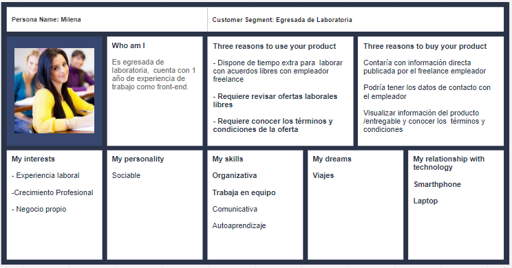
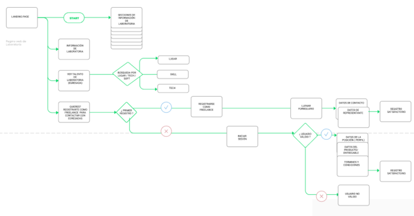
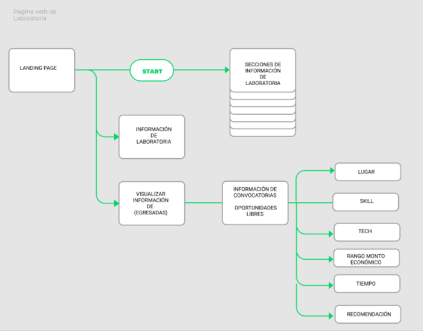

#  
Es una app que permite 

## Proyecto desarrollado en [Laboratoria](http://laboratoria.la)

## En  [Peru](http://peru.com)

# 🚩 Tabla de contenido

- [USER PERSONAS](#user-persona)
- [DEFINICIÓN DEL PROBLEMA](#definición-del-problema)
- [USER FLOWS](#user-flows)

## USER PERSONAS

| Entregable - User Person | Link | 
| ---- | ---- | 
| **User Laboratoria**  |https://realtimeboard.com/app/board/o9J_kzzXNgE=/ |
| **User Egresada**  |https://realtimeboard.com/app/board/o9J_kzzXN1E=/|
| **User Freelance**  |  |

## DEFINICIÓN DEL PROBLEMA

Ausencia de un espacio de contacto entre freelance y egresadas de laboratoria.

| Usuarios | Característica  | Necesidad |
| ---- | ---- | ---- |
| **Egresadas**  |Alumnas de Laboratoria que culminaron el bootcamp.| requieren visualizar oportunidades laborales|
| **Freelance** |Persona natural, empresa, startup, etc | requiere realizar un acuerdo laboral libre |
| **Laboratoria** |Entidad  |que canaliza las ofertas laborales en el portal de laboratoria para que sean visualizadas por las alumnas |

## USERS FLOWS

User Flow - Freelancer

User Flow - Egresada

| Entregable - User Flow | Link | 
| ---- | ---- |
| Freelance | https://www.figma.com/file/VsWFEhxtQ5ssLhrWORCTU5Wz/user-flow-diagram-template?node-id=1%3A138|  
| Egresada | https://www.figma.com/file/VsWFEhxtQ5ssLhrWORCTU5Wz/user-flow-diagram-template?node-id=23%3A378|  
| Laboratoria | |  

